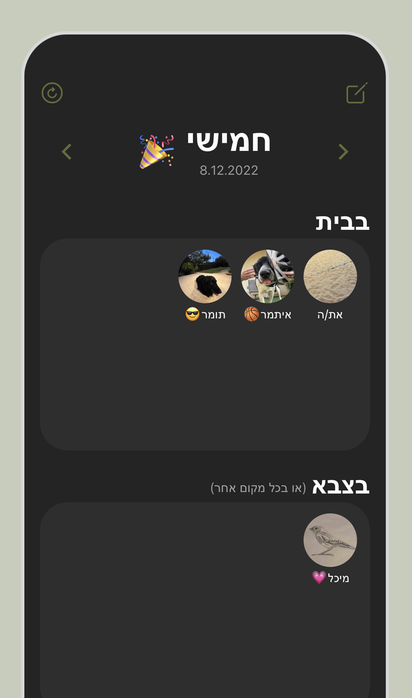
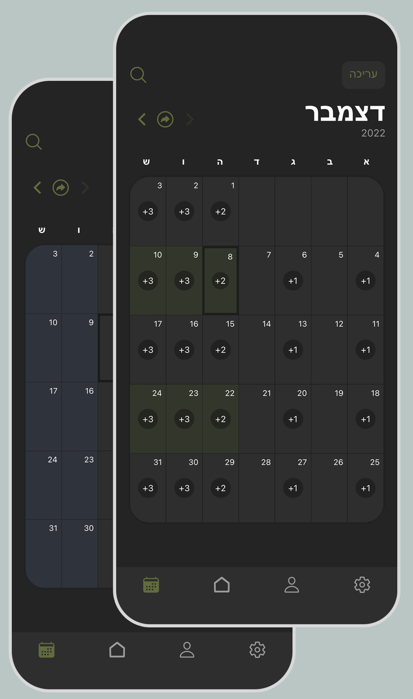
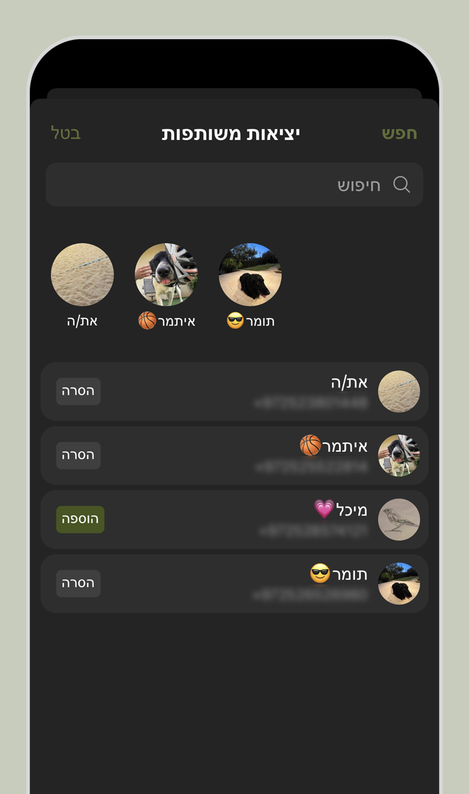
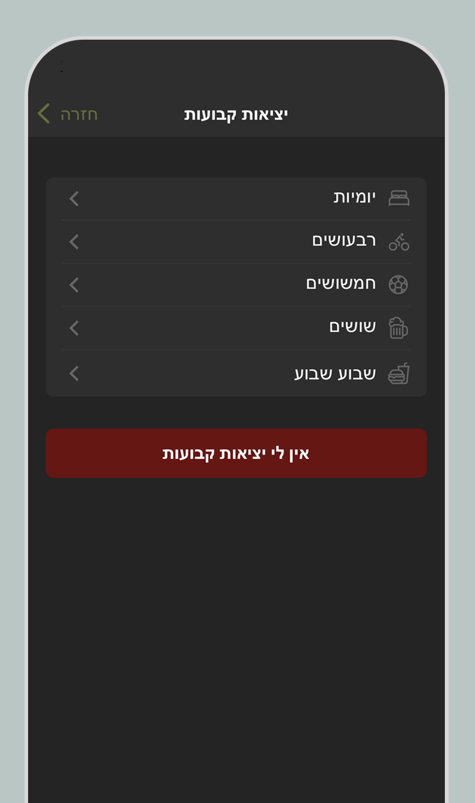

# Yetziot 📱

Yetziot helps you keep track of when your friends are back home from the army, university, or anywhere else.

    
    
    
    

## Installation

To install Yetziot, download it from:

- [App Store](https://apps.apple.com/il/app/%D7%9E%D7%99-%D7%91%D7%91%D7%99%D7%AA/id1663631282)
- [Play Store](https://play.google.com/store/apps/details?id=com.yetziot)

## Terms and Privacy

Before using Yetziot, please review our [Terms of Service](https://guyavrhm.github.io/yetziot-public/terms.html) and [Privacy Policy](https://guyavrhm.github.io/yetziot-public/privacy.html) for information on how we collect, use, and protect your data.

## Contact

For contact, you can send an email to [yetziot.app@gmail.com](mailto:yetziot.app@gmail.com).
